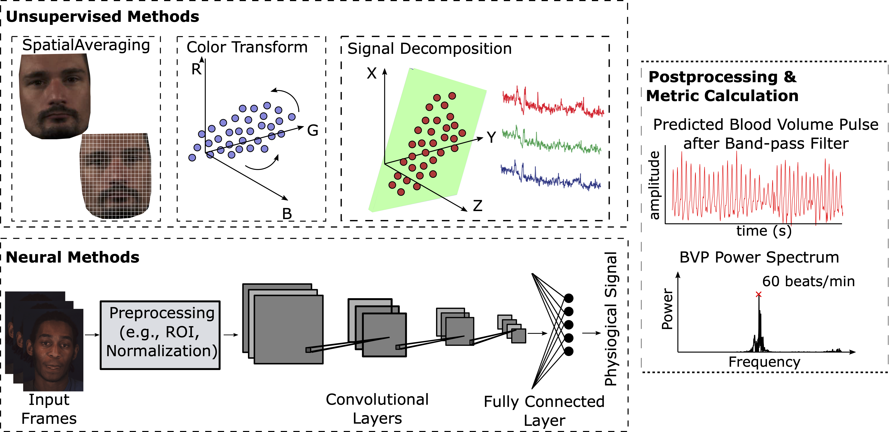
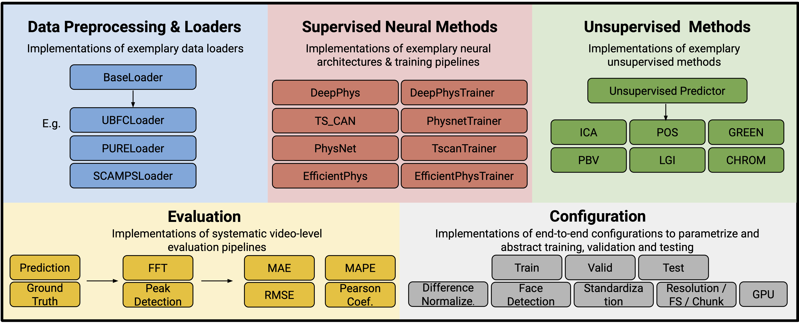
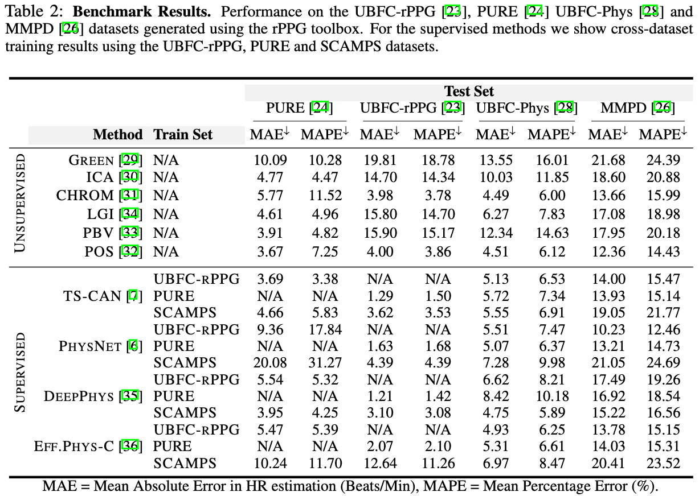
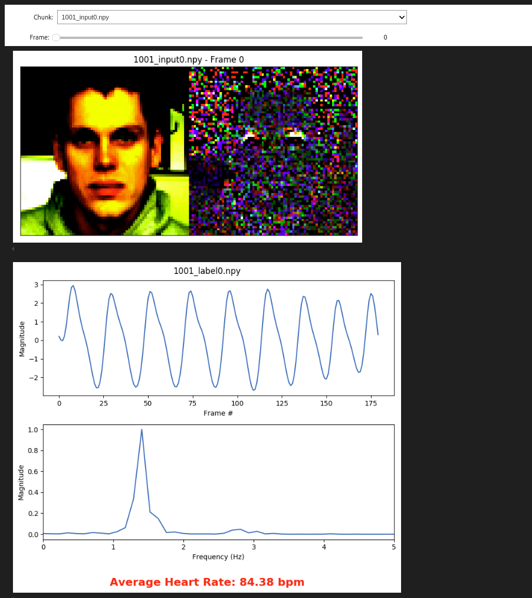
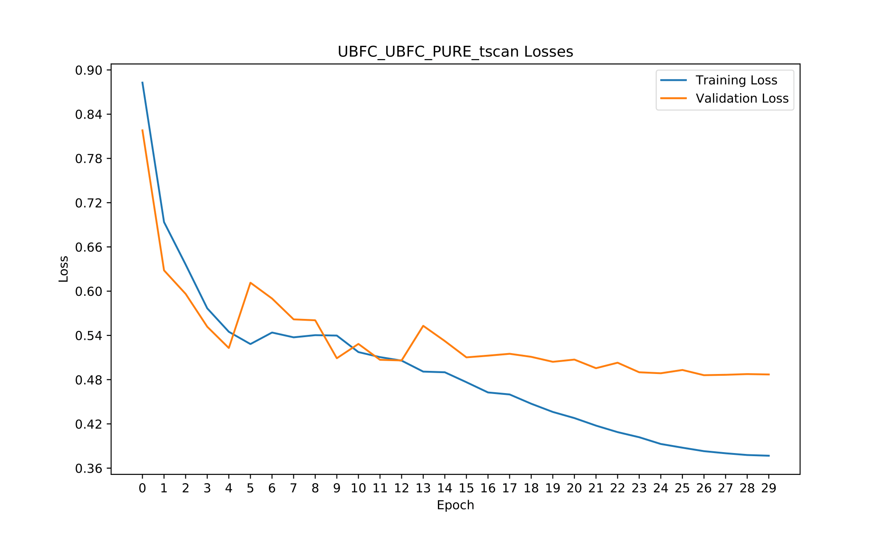
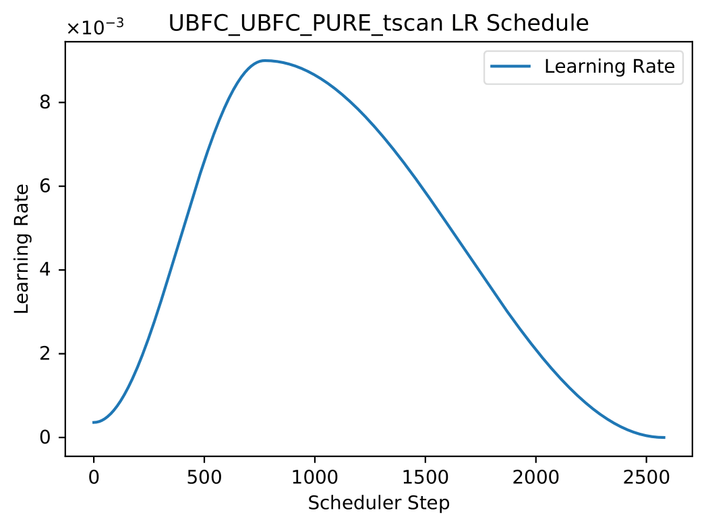
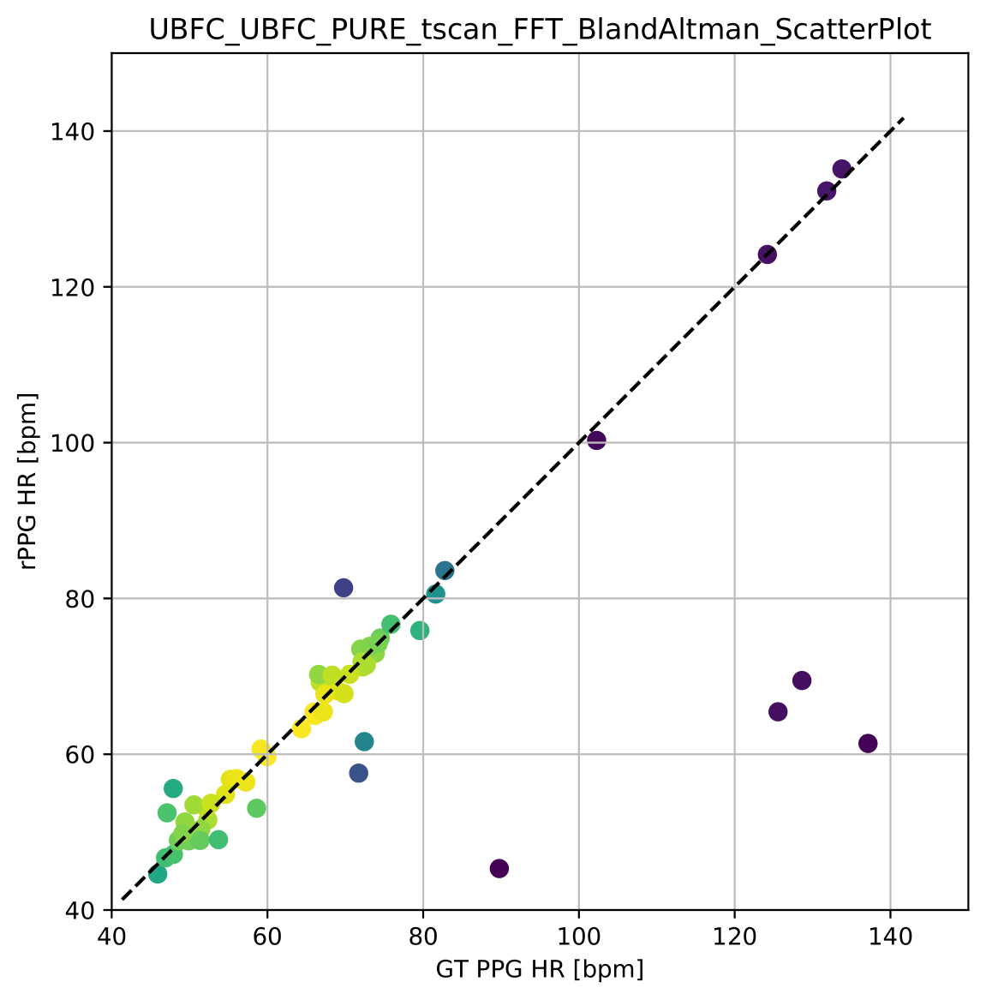
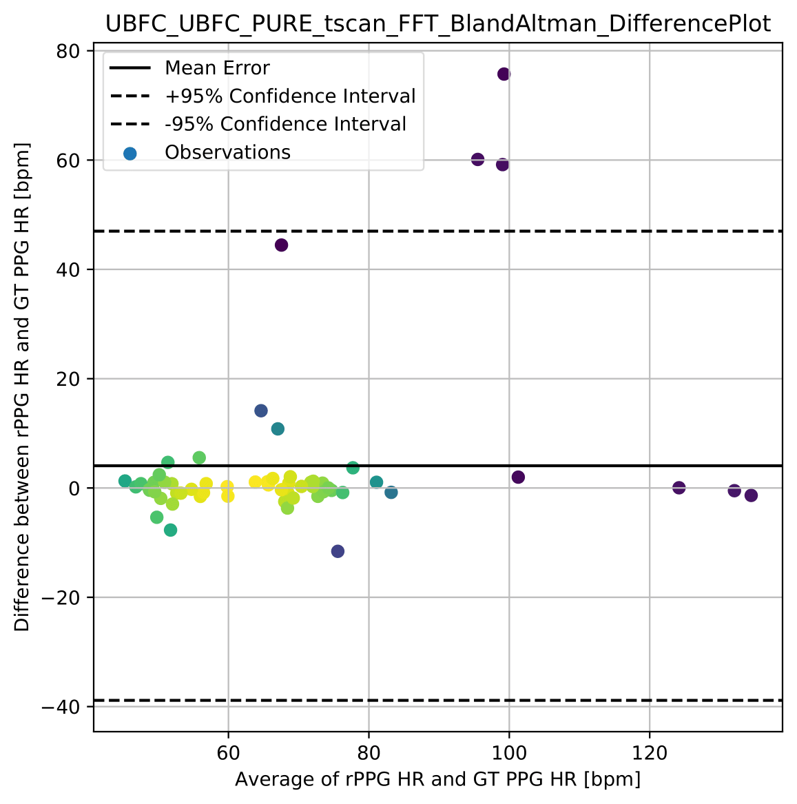
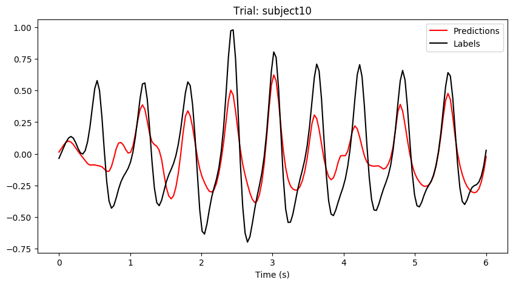
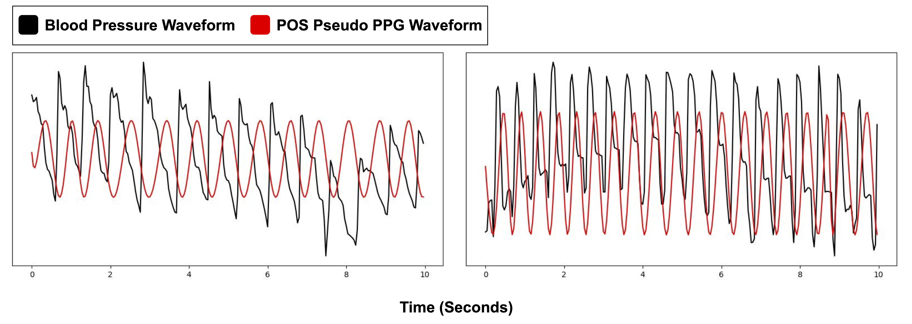

<p align="center">
:fire: Please remember to :star: this repo if you find it useful and cite our work if you end up using it in your work! :fire:
</p>
<p align="center">
:fire: If you have any questions or concerns, please create an <a href="https://github.com/ubicomplab/rPPG-Toolbox/issues">issue</a> :memo:! :fire:
</p>


# :wave: Introduction

**rPPG-Toolbox** is an open-source platform designed for camera-based physiological sensing, also known as remote photoplethysmography (rPPG). 




rPPG-Toolbox not only benchmarks the **existing state-of-the-art neural and unsupervised methods**, but it also supports flexible and rapid development of your own algorithms.



# :notebook: Algorithms
rPPG-Toolbox currently supports the following algorithms: 

* Traditional Unsupervised Algorithms
  - [Remote plethysmographic imaging using ambient light (GREEN)](https://pdfs.semanticscholar.org/7cb4/46d61a72f76e774b696515c55c92c7aa32b6.pdf?_gl=1*1q7hzyz*_ga*NTEzMzk5OTY3LjE2ODYxMDg1MjE.*_ga_H7P4ZT52H5*MTY4NjEwODUyMC4xLjAuMTY4NjEwODUyMS41OS4wLjA), by Verkruysse *et al.*, 2008
  - [Advancements in noncontact multiparameter physiological measurements using a webcam (ICA)](https://affect.media.mit.edu/pdfs/11.Poh-etal-TBME.pdf), by Poh *et al.*, 2011
  - [Robust pulse rate from chrominance-based rppg (CHROM)](https://ieeexplore.ieee.org/document/6523142), by Haan *et al.*, 2013
  - [Local group invariance for heart rate estimation from face videos in the wild (LGI)](https://openaccess.thecvf.com/content_cvpr_2018_workshops/papers/w27/Pilz_Local_Group_Invariance_CVPR_2018_paper.pdf), by Pilz *et al.*, 2018
  - [Improved motion robustness of remote-PPG by using the blood volume pulse signature (PBV)](https://iopscience.iop.org/article/10.1088/0967-3334/35/9/1913), by Haan *et al.*, 2014
  - [Algorithmic principles of remote ppg (POS)](https://ieeexplore.ieee.org/document/7565547), by Wang *et al.*, 2016


* Supervised Neural Algorithms 
  - [DeepPhys: Video-Based Physiological Measurement Using Convolutional Attention Networks (DeepPhys)](https://openaccess.thecvf.com/content_ECCV_2018/papers/Weixuan_Chen_DeepPhys_Video-Based_Physiological_ECCV_2018_paper.pdf), by Chen *et al.*, 2018
  - [Remote Photoplethysmograph Signal Measurement from Facial Videos Using Spatio-Temporal Networks (PhysNet)](https://bmvc2019.org/wp-content/uploads/papers/0186-paper.pdf), by Yu *et al.*, 2019
  - [Multi-Task Temporal Shift Attention Networks for On-Device Contactless Vitals Measurement (TS-CAN)](https://papers.nips.cc/paper/2020/file/e1228be46de6a0234ac22ded31417bc7-Paper.pdf), by Liu *et al.*, 2020
  - [EfficientPhys: Enabling Simple, Fast and Accurate Camera-Based Cardiac Measurement (EfficientPhys)](https://openaccess.thecvf.com/content/WACV2023/papers/Liu_EfficientPhys_Enabling_Simple_Fast_and_Accurate_Camera-Based_Cardiac_Measurement_WACV_2023_paper.pdf), by Liu *et al.*, 2023
  - [BigSmall: Efficient Multi-Task Learning for Disparate Spatial and Temporal Physiological Measurements
 (BigSmall)](https://arxiv.org/abs/2303.11573), by Narayanswamy *et al.*, 2023
  - [PhysFormer: Facial Video-based Physiological Measurement with Temporal Difference Transformer (PhysFormer)](https://openaccess.thecvf.com/content/CVPR2022/papers/Yu_PhysFormer_Facial_Video-Based_Physiological_Measurement_With_Temporal_Difference_Transformer_CVPR_2022_paper.pdf), by Yu *et al.*, 2022

# :file_folder: Datasets
The toolbox supports six datasets, namely SCAMPS, UBFC-rPPG, PURE, BP4D+, UBFC-Phys, and MMPD. Please cite the corresponding papers when using these datasets. For now, we recommend training with UBFC-rPPG, PURE, or SCAMPS due to the level of synchronization and volume of the datasets. **To use these datasets in a deep learning model, you should organize the files as follows.**
* [MMPD](https://github.com/McJackTang/MMPD_rPPG_dataset)
    * Jiankai Tang, Kequan Chen, Yuntao Wang, Yuanchun Shi, Shwetak Patel, Daniel McDuff, Xin Liu, "MMPD: Multi-Domain Mobile Video Physiology Dataset", IEEE EMBC, 2023
    -----------------
         data/MMPD/
         |   |-- subject1/
         |       |-- p1_0.mat
         |       |-- p1_1.mat
         |       |...
         |       |-- p1_19.mat
         |   |-- subject2/
         |       |-- p2_0.mat
         |       |-- p2_1.mat
         |       |...
         |...
         |   |-- subjectn/
         |       |-- pn_0.mat
         |       |-- pn_1.mat
         |       |...
    -----------------
    
* [SCAMPS](https://arxiv.org/abs/2206.04197)
    * D. McDuff, M. Wander, X. Liu, B. Hill, J. Hernandez, J. Lester, T. Baltrusaitis, "SCAMPS: Synthetics for Camera Measurement of Physiological Signals", NeurIPS, 2022
    -----------------
         data/SCAMPS/Train/
            |-- P00001.mat
            |-- P00002.mat
         |...
         data/SCAMPS/Val/
            |-- P00001.mat
            |-- P00002.mat
         |...
         data/SCAMPS/Test/
            |-- P00001.mat
            |-- P00002.mat
         |...
    -----------------

* [UBFC-rPPG](https://sites.google.com/view/ybenezeth/ubfcrppg)
    * S. Bobbia, R. Macwan, Y. Benezeth, A. Mansouri, J. Dubois, "Unsupervised skin tissue segmentation for remote photoplethysmography", Pattern Recognition Letters, 2017.
    -----------------
         data/UBFC-rPPG/
         |   |-- subject1/
         |       |-- vid.avi
         |       |-- ground_truth.txt
         |   |-- subject2/
         |       |-- vid.avi
         |       |-- ground_truth.txt
         |...
         |   |-- subjectn/
         |       |-- vid.avi
         |       |-- ground_truth.txt
    -----------------
   
* [PURE](https://www.tu-ilmenau.de/universitaet/fakultaeten/fakultaet-informatik-und-automatisierung/profil/institute-und-fachgebiete/institut-fuer-technische-informatik-und-ingenieurinformatik/fachgebiet-neuroinformatik-und-kognitive-robotik/data-sets-code/pulse-rate-detection-dataset-pure)
    * Stricker, R., Müller, S., Gross, H.-M.Non-contact "Video-based Pulse Rate Measurement on a Mobile Service Robot"
in: Proc. 23st IEEE Int. Symposium on Robot and Human Interactive Communication (Ro-Man 2014), Edinburgh, Scotland, UK, pp. 1056 - 1062, IEEE 2014
    -----------------
         data/PURE/
         |   |-- 01-01/
         |      |-- 01-01/
         |      |-- 01-01.json
         |   |-- 01-02/
         |      |-- 01-02/
         |      |-- 01-02.json
         |...
         |   |-- ii-jj/
         |      |-- ii-jj/
         |      |-- ii-jj.json
    -----------------
    
* [BP4D+](https://www.cs.binghamton.edu/~lijun/Research/3DFE/3DFE_Analysis.html)
    * Zhang, Z., Girard, J., Wu, Y., Zhang, X., Liu, P., Ciftci, U., Canavan, S., Reale, M., Horowitz, A., Yang, H., Cohn, J., Ji, Q., Yin, L. "Multimodal Spontaneous Emotion Corpus for Human Behavior Analysis", IEEE International Conference on Computer Vision and Pattern Recognition (CVPR) 2016.   
    -----------------
        RawData/
         |   |-- 2D+3D/
         |       |-- F001.zip/
         |       |-- F002.zip
         |       |...
         |   |-- 2DFeatures/
         |       |-- F001_T1.mat
         |       |-- F001_T2.mat
         |       |...
         |   |-- 3DFeatures/
         |       |-- F001_T1.mat
         |       |-- F001_T2.mat
         |       |...
         |   |-- AUCoding/
         |       |-- AU_INT/
         |            |-- AU06/
         |               |-- F001_T1_AU06.csv
         |               |...
         |           |...
         |       |-- AU_OCC/
         |           |-- F00_T1.csv 
         |           |...
         |   |-- IRFeatures/
         |       |-- F001_T1.txt
         |       |...
         |   |-- Physiology/
         |       |-- F001/
         |           |-- T1/
         |               |-- BP_mmHg.txt
         |               |-- microsiemens.txt
         |               |--LA Mean BP_mmHg.txt
         |               |--LA Systolic BP_mmHg.txt
         |               |-- BP Dia_mmHg.txt
         |               |-- Pulse Rate_BPM.txt
         |               |-- Resp_Volts.txt
         |               |-- Respiration Rate_BPM.txt
         |       |...
         |   |-- Thermal/
         |       |-- F001/
         |           |-- T1.mv
         |           |...
         |       |...
         |   |-- BP4D+UserGuide_v0.2.pdf
    -----------------

* [UBFC-Phys](https://sites.google.com/view/ybenezeth/ubfc-phys)
    * Sabour, R. M., Benezeth, Y., De Oliveira, P., Chappe, J., & Yang, F. (2021). Ubfc-phys: A multimodal database for psychophysiological studies of social stress. IEEE Transactions on Affective Computing.  
    -----------------
          RawData/
          |   |-- s1/
          |       |-- vid_s1_T1.avi
          |       |-- vid_s1_T2.avi
          |       |...
          |       |-- bvp_s1_T1.csv
          |       |-- bvp_s1_T2.csv
          |   |-- s2/
          |       |-- vid_s2_T1.avi
          |       |-- vid_s2_T2.avi
          |       |...
          |       |-- bvp_s2_T1.csv
          |       |-- bvp_s2_T2.csv
          |...
          |   |-- sn/
          |       |-- vid_sn_T1.avi
          |       |-- vid_sn_T2.avi
          |       |...
          |       |-- bvp_sn_T1.csv
          |       |-- bvp_sn_T2.csv
    -----------------

## :bar_chart: Benchmarks

The table shows  Mean Absolute Error (MAE) and Mean Absolute Percent Error (MAPE) performance across all the algorithms and datasets:



# :wrench: Setup

STEP 1: `bash setup.sh` 

STEP 2: `conda activate rppg-toolbox` 

STEP 3: `pip install -r requirements.txt` 

# :computer: Example of Using Pre-trained Models 

Please use config files under `./configs/infer_configs`

For example, if you want to run The model trained on PURE and tested on UBFC-rPPG, use `python main.py --config_file ./configs/infer_configs/PURE_UBFC-rPPG_TSCAN_BASIC.yaml`

If you want to test unsupervised signal processing  methods, you can use `python main.py --config_file ./configs/infer_configs/UBFC-rPPG_UNSUPERVISED.yaml`

# :computer: Examples of Neural Network Training

Please use config files under `./configs/train_configs`

## Training on PURE and Testing on UBFC-rPPG With TSCAN 

STEP 1: Download the PURE raw data by asking the [paper authors](https://www.tu-ilmenau.de/universitaet/fakultaeten/fakultaet-informatik-und-automatisierung/profil/institute-und-fachgebiete/institut-fuer-technische-informatik-und-ingenieurinformatik/fachgebiet-neuroinformatik-und-kognitive-robotik/data-sets-code/pulse-rate-detection-dataset-pure).

STEP 2: Download the UBFC-rPPG raw data via [link](https://sites.google.com/view/ybenezeth/ubfcrppg)

STEP 3: Modify `./configs/train_configs/PURE_PURE_UBFC-rPPG_TSCAN_BASIC.yaml` 

STEP 4: Run `python main.py --config_file ./configs/train_configs/PURE_PURE_UBFC-rPPG_TSCAN_BASIC.yaml` 

Note 1: Preprocessing requires only once; thus turn it off on the yaml file when you train the network after the first time. 

Note 2: The example yaml setting will allow 80% of PURE to train and 20% of PURE to valid. 
After training, it will use the best model(with the least validation loss) to test on UBFC-rPPG.

## Training on SCAMPS and testing on UBFC-rPPG With DeepPhys

STEP 1: Download the SCAMPS via this [link](https://github.com/danmcduff/scampsdataset) and split it into train/val/test folders.

STEP 2: Download the UBFC-rPPG via [link](https://sites.google.com/view/ybenezeth/ubfcrppg)

STEP 3: Modify `./configs/train_configs/SCAMPS_SCAMPS_UBFC-rPPG_DEEPPHYS_BASIC.yaml` 

STEP 4: Run `python main.py --config_file ./configs/train_configs/SCAMPS_SCAMPS_UBFC-rPPG_DEEPPHYS_BASIC.yaml`

Note 1: Preprocessing requires only once; thus turn it off on the yaml file when you train the network after the first time. 

Note 2: The example yaml setting will allow 80% of SCAMPS to train and 20% of SCAMPS to valid. 
After training, it will use the best model(with the least validation loss) to test on UBFC-rPPG.

# :zap: Inference With Unsupervised Methods 

STEP 1: Download the UBFC-rPPG via [link](https://sites.google.com/view/ybenezeth/ubfcrppg)

STEP 2: Modify `./configs/infer_configs/UBFC_UNSUPERVISED.yaml` 

STEP 3: Run `python main.py --config_file ./configs/infer_configs/UBFC_UNSUPERVISED.yaml`

# :eyes: Visualization of Preprocessed Data
A python notebook for visualizing preprocessed data can be found in `tools/preprocessing_viz` along with an associated README. The notebook, `viz_preprocessed_data.ipynb`, automatically detects the preprocessed data format and then plots input image examples and waveforms. 


# :chart_with_downwards_trend: Plots of Training Losses and LR

This toolbox saves plots of training, and if applicable, validation losses automatically. Plots are saved in `LOG.PATH` (`runs/exp` by default). An example of these plots when training and validating with the UBFC-rPPG dataset and testing on the PURE dataset are shown below.




# :straight_ruler: Bland-Altman Plots

By default, this toolbox produces Bland-Altman plots as a part of its metrics evaluation process for both supervised and unsupervised methods. These plots are saved in the `LOG.PATH` (`runs/exp` by default). An example of these plots after training and validating with the UBFC-rPPG dataset and testing on the PURE dataset are shown below.

 

# :eyes: Visualization of Neural Method Predictions

A python notebook for visualizing test-set neural method output predictions and labels can be found in `tools/output_signal_viz` along with an associated README. The notebook, `data_out_viz.ipynb`, given a `.pickle` output file, generated by setting `TEST.OUTPUT_SAVE_DIR` assists in plotting predicted PPG signals against ground-truth PPG signals.


# :scroll: YAML File Setting
The rPPG-Toolbox uses yaml file to control all parameters for training and evaluation. 
You can modify the existing yaml files to meet your own training and testing requirements.

Here are some explanation of parameters:
* #### TOOLBOX_MODE: 
  * `train_and_test`: train on the dataset and use the newly trained model to test.
  * `only_test`: you need to set INFERENCE-MODEL_PATH, and it will use pre-trained model initialized with the MODEL_PATH to test.
* #### TRAIN / VALID / TEST / UNSUPERVISED DATA:
  * `PLOT_LOSSES_AND_LR`: If `True`, save plots of the training loss and validation loss, as well as the learning rate, to `LOG.PATH` (`runs/exp` by default). Currently, only a basic training loss and validation loss are plotted, but in the future additional losses utilized in certain trainer files (e.g., PhysFormer and BigSmall) will also be captured.
  * `USE_EXCLUSION_LIST`: If `True`, utilize a provided list to exclude preprocessed videos
  * `SELECT_TASKS`: If `True`, explicitly select tasks to load 
  * `DATA_PATH`: The input path of raw data
  * `CACHED_PATH`: The output path to preprocessed data. This path also houses a directory of .csv files containing data paths to files loaded by the dataloader. This filelist (found in default at CACHED_PATH/DataFileLists). These can be viewed for users to understand which files are used in each data split (train/val/test)
  * `EXP_DATA_NAME` If it is "", the toolbox generates a EXP_DATA_NAME based on other defined parameters. Otherwise, it uses the user-defined EXP_DATA_NAME.  
  * `BEGIN" & "END`: The portion of the dataset used for training/validation/testing. For example, if the `DATASET` is PURE, `BEGIN` is 0.0 and `END` is 0.8 under the TRAIN, the first 80% PURE is used for training the network. If the `DATASET` is PURE, `BEGIN` is 0.8 and `END` is 1.0 under the VALID, the last 20% PURE is used as the validation set. It is worth noting that validation and training sets don't have overlapping subjects.  
  * `DATA_TYPE`: How to preprocess the video data
  * `DATA_AUG`: If present, the type of generative data augmentation applied to video data
  * `LABEL_TYPE`: How to preprocess the label data
  *  `USE_PSUEDO_PPG_LABEL`: If `True` use POS generated PPG psuedo labels instead of dataset ground truth heart singal waveform
  * `DO_CHUNK`: Whether to split the raw data into smaller chunks
  * `CHUNK_LENGTH`: The length of each chunk (number of frames)
  * `DO_CROP_FACE`: Whether to perform face detection
  * `BACKEND`: Select which backend to use for face detection. Currently, the options are HC (Haar Cascade) or RF (RetinaFace). We recommend using Haar Cascade (the config default) in order to reproduce results from the [NeurIPS 2023 Datasets and Benchmarks paper](https://arxiv.org/abs/2210.00716) that corresponds to this toolbox. If you use RetinaFace, we recommend that you experiment with parameters such as `LARGE_BOX_COEF` and `USE_MEDIAN_BOX` depending on what dataset you are preprocessnig. We plan to update this README with optimal settings to use with RetinaFace in the near future.
  * `DYNAMIC_DETECTION`: If `False`, face detection is only performed at the first frame and the detected box is used to crop the video for all of the subsequent frames. If `True`, face detection is performed at a specific frequency which is defined by `DYNAMIC_DETECTION_FREQUENCY`. 
  * `DYNAMIC_DETECTION_FREQUENCY`: The frequency of face detection (number of frames) if DYNAMIC_DETECTION is `True`
  * `USE_MEDIAN_FACE_BOX`: If `True` and `DYNAMIC_DETECTION` is `True`, use the detected face boxs throughout each video to create a single, median face box per video.
  * `LARGE_FACE_BOX`: Whether to enlarge the rectangle of the detected face region in case the detected box is not large enough for some special cases (e.g., motion videos)
  * `LARGE_BOX_COEF`: The coefficient to scale the face box if `LARGE_FACE_BOX` is `True`.
  * `INFO`: This is a collection of parameters based on attributes of a dataset, such as gender, motion types, and skin color, that help select videos for inclusion in training, validation, or testing. Currently, only the [MMPD](https://github.com/McJackTang/MMPD_rPPG_dataset) dataset is supported for parameter-based video inclusion. Please refer to one of the config files involving the [MMPD](https://github.com/McJackTang/MMPD_rPPG_dataset) dataset for an example of using these parameters.
  * `EXCLUSION_LIST`: A list that specifies videos to exclude, typically based on a unique identifier to a video such as the combination of a subject ID and a task ID. This is only used if `USE_EXCLUSION_LIST` is set to `True`. Currently this parameter is only tested with the [UBFC-Phys](https://sites.google.com/view/ybenezeth/ubfc-phys) dataset. Please refer to one of the config files involving the [UBFC-Phys](https://sites.google.com/view/ybenezeth/ubfc-phys) dataset for an example of using this parameter.
  * `TASK_LIST`: A list to specify tasks to include when loading a dataset, allowing for selective inclusion of a subset of tasks or a single task in a dataset if desired. This is only used if `SELECT_TASKS` is set to `True`. Currently this parameter is only tested with the [UBFC-Phys](https://sites.google.com/view/ybenezeth/ubfc-phys) dataset. Please refer to one of the config files involving the [UBFC-Phys](https://sites.google.com/view/ybenezeth/ubfc-phys) dataset for an example of using this parameter.

  
* #### MODEL : Set used model (Deepphys, TSCAN, Physnet, EfficientPhys, BigSmall, and PhysFormer and their paramaters are supported).
* #### UNSUPERVISED METHOD: Set used unsupervised method. Example: ["ICA", "POS", "CHROM", "GREEN", "LGI", "PBV"]
* #### METRICS: Set used metrics. Example: ['MAE','RMSE','MAPE','Pearson','SNR','BA']
  * 'BA' metric corresponds to the generation of a Bland-Altman plot to graphically compare two measurement techniques (e.g., differences between measured and ground truth heart rates versus mean of measured and ground truth heart rates). This metric saves the plot in the `LOG.PATH` (`runs/exp` by default).
* #### INFERENCE:
  * `USE_SMALLER_WINDOW`: If `True`, use an evaluation window smaller than the video length for evaluation.

    
# :open_file_folder: Adding a New Dataset

* STEP 1: Create a new python file in `dataset/data_loader`, e.g. MyLoader.py

* STEP 2: Implement the required functions, including:

  ```python
  def preprocess_dataset(self, config_preprocess):
  ```
  ```python
  @staticmethod
  def read_video(video_file):
  ```
  ```python
  @staticmethod
  def read_wave(bvp_file):
  ```

* STEP 3:[Optional] Override optional functions. In principle, all functions in BaseLoader can be override, but we **do not** recommend you to override *\_\_len\_\_, \_\_get\_item\_\_,save,load*.
* STEP 4:Set or add configuration parameters.  To set paramteters, create new yaml files in configs/ .  Adding parameters requires modifying config.py, adding new parameters' definition and initial values.

# :robot: Adding a New Neural Algorithms

* STEP 1: Define a model in a new python file in `neural_methods/model`, e.g. NewModel.py.

* STEP 2: Implement the corresponding training/testing routines in a file `neural_methods/trainer`, e.g. NewModelTrainer.py. Ensure to implement the following functions:

  ```python
  def __init__(self, config, data_loader):
  ```
  ```python
  def train(self, data_loader):
  ```
  ```python
  def valid(self, data_loader):
  ```

  ```python
  def test(self, data_loader)
  ```

  ```python
  def save_model(index)
  ```

* STEP 3: Add logic to `main.py` to use the models in the following `train_and_test` and `test` functions. 

* STEP 4: Create new yaml files in configs/ corresponding to the new algorithm.

# :chart_with_upwards_trend: Adding a New Unsupervised Algorithms

* STEP 1: Define a algorithm in a new python file in `neural_methods/model`, e.g. NewModel.py.

* STEP 2: Add logic to `main.py` to use the models in the following `unsupervised_method_inference` function. 

* STEP 4: Create new yaml files in configs/ corresponding to the new algorithm.

# :green_book: Weakly Supervised Training 

Supervised rPPG training requires high fidelity synchronous PPG waveform labels. However not all datasets contain such high quality labels. In these cases we offer the option to train on synchronous PPG "pseudo" labels derived through a signal processing methodology. These labels are produced by using POS-generated PPG waveforms, which are then bandpass filtered around the normal heart-rate frequencies, and finally amplitude normalized using a Hilbert-signal envelope. The tight filtering and envelope normalization results in a strong periodic proxy signal, but at the cost of limited signal morphology.



# :blue_book: Motion Augmented Training

The usage of synthetic data in the training of machine learning models for medical applications is becoming a key tool that warrants further research. In addition to providing support for the fully synthetic dataset [SCAMPS](https://arxiv.org/abs/2206.04197), we provide provide support for synthetic, motion-augmented versions of the [UBFC-rPPG](https://sites.google.com/view/ybenezeth/ubfcrppg), [PURE](https://www.tu-ilmenau.de/universitaet/fakultaeten/fakultaet-informatik-und-automatisierung/profil/institute-und-fachgebiete/institut-fuer-technische-informatik-und-ingenieurinformatik/fachgebiet-neuroinformatik-und-kognitive-robotik/data-sets-code/pulse-rate-detection-dataset-pure), [SCAMPS](https://arxiv.org/abs/2206.04197), and [UBFC-Phys](https://sites.google.com/view/ybenezeth/ubfc-phys) datasets for further exploration toward the use of synthetic data for training rPPG models. The synthetic, motion-augmented datasets are generated using the [MA-rPPG Video Toolbox](https://github.com/Roni-Lab/MA-rPPG-Video-Toolbox), an open-source motion augmentation pipeline targeted for increasing motion diversity in rPPG videos. You can generate and utilize the aforementioned motion-augmented datasets using the steps below.

* STEP 1: Follow the instructions in the [README](https://github.com/Roni-Lab/MA-rPPG-Video-Toolbox/blob/main/README.md) of the [MA-rPPG Video Toolbox](https://github.com/Roni-Lab/MA-rPPG-Video-Toolbox) GitHub repo to generate any of the supported motion-augmented datasets. NOTE: You will have to have an original, unaugmented version of a dataset and driving video to generate a motion-augmented dataset. More information can be found [here](https://github.com/Roni-Lab/MA-rPPG-Video-Toolbox#file_folder-datasets). 

* STEP 2: Using any config file of your choice in this toolbox, modify the `DATA_AUG` parameter (set to `'None'` by default) to `'Motion'`. Currently, only `train_configs` that utilize the UBFC-rPPG or PURE datasets have this parameter visible, but you can also modify other config files to add the `DATA_AUG` parameter below the `DATA_TYPE` parameter that is visible in all config files. This will enable the proper funciton for loading motion-augmented data that is in the `.npy` format.

* STEP 3: Run the corresponding config file. Your saved model's filename will have `MA` appended to the corresponding data splits that are motion-augmented.

If you use the aforementioned functionality, please remember to cite the following in addition to citing the rPPG-Toolbox:
* Paruchuri, A., Liu, X., Pan, Y., Patel, S., McDuff, D., & Sengupta, S. (2023). Motion Matters: Neural Motion Transfer for Better Camera Physiological Sensing. arXiv preprint arXiv:2303.12059.

Refer to this [BibTeX](https://github.com/Roni-Lab/MA-rPPG-Video-Toolbox#scroll-citation) for quick inclusion into a `.bib` file.

<p align="center">
  
</p>

# :orange_book: Extending the Toolbox to Multi-Tasking With BigSmall

We implement [BigSmall](https://girishvn.github.io/BigSmall/) as an example to show how this toolbox may be extended to support physiological multitasking. If you use this functionality please cite the following publication: 
* Narayanswamy, G., Liu, Y., Yang, Y., Ma, C., Liu, X., McDuff, D., Patel, S. "BigSmall: Efficient Multi-Task Learning For Physiological Measurements" https://arxiv.org/abs/2303.11573

The BigSmall mode multi-tasks pulse (PPG regression), respiration (regression), and facial action (multilabel AU classification). The model is trained and evaluated (in this toolbox) on the AU label subset (described in the BigSmall publication) of the BP4D+ dataset, using a 3-fold cross validation method (using the same folds as in the BigSmall publication).

* STEP 1: Download the BP4D+ by emailing the authors found [here](https://www.cs.binghamton.edu/~lijun/Research/3DFE/3DFE_Analysis.html).

* STEP 2: Modify `./configs/train_configs/BP4D_BP4D_BIGSMALL_FOLD1.yaml` to train the first fold (config files also exist for the 2nd and 3rd fold).

* STEP 3: Run `python main.py --config_file ./configs/train_configs/BP4D_BP4D_BIGSMALL_FOLD1.yaml `

<p align="center">
  
</p>

# :page_with_curl: Using Custom Data Splits and Custom File Lists

Best practice for rPPG model evaluation involves training and validating a model on one dataset and then evaluating (testing) the performance on additional datasets (Eg. training on PURE and testing on UBFC). Data splits used for training, validation, and testing are saved as .csv filelists with the default directory path set as `CACHED_PATH/DataFileLists` (this are generally auto generated). In cases where users would like to define their own data splits (Eg. for intra-dataset cross validation), the following steps can be used to achieve this.  

* STEP 1: Collect all file paths for the data splits's input files (An example file path would be of format `CACHED_PATH/PREPROCESSED_DATASET/*input*.npy`, eg. `405_input9.npy`). Ensure the corresponding `*label*.npy` files exists in the same directory as the input files.

* STEP 2: Add all file paths to a .csv with column name `input_files`. We suggest creating a pandas dataframe and then saving this out to the csv. This .csv file is the file list for your custom data split. The file can be named anything as long as it has an .csv extension.

* STEP 3: In the desired experiment config file, enter the file path of the .csv file list using keyword `FILE_LIST_PATH` in the `DATA` field of the desired train/valid/test split. The dataloader will load input and label files specified in this file path. 

# :scroll: Citation
If you find our [paper](https://arxiv.org/abs/2210.00716) or this toolbox useful for your research, please cite our work.

```
@article{liu2022rppg,
  title={rPPG-Toolbox: Deep Remote PPG Toolbox},
  author={Liu, Xin and Narayanswamy, Girish and Paruchuri, Akshay and Zhang, Xiaoyu and Tang, Jiankai and Zhang, Yuzhe and Wang, Yuntao and Sengupta, Soumyadip and Patel, Shwetak and McDuff, Daniel},
  journal={arXiv preprint arXiv:2210.00716},
  year={2022}
}
```

# License
<a href="https://www.licenses.ai/source-code-license">
  
</a>

# Acknowledgement 

This research project is supported by a Google PhD Fellowship for Xin Liu and a research grant from Cisco for the University of Washington as well as a career start-up funding grant from the Department of Computer Science at UNC Chapel Hill. This research is also supported by Tsinghua University Initiative Scientific Research Program, Beijing Natural Science Foundation,  and the Natural Science Foundation of China (NSFC). We also would like to acknowledge all the contributors from the open-source community. 

