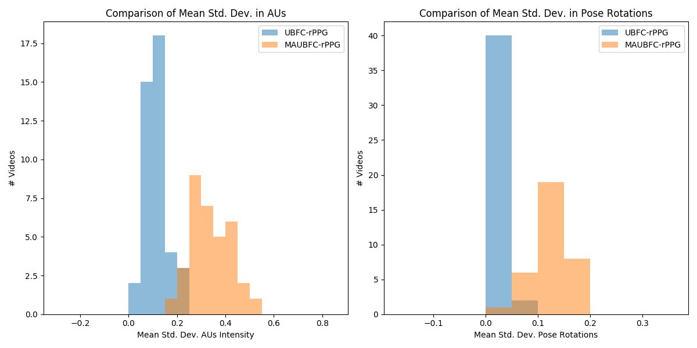

# Motion Analysis Tools

In this folder, we provide scripts that ultimately leverage OpenFace for extracting, visualizing, and analyzing motion in rPPG video datasets. Specifically, we include a Python script to convert datasets into the .mp4 format for subsequent analysis by OpenFace, a shell script that levereges OpenFace to perform both rigid and non-rigid head motion analysis, and a separate Python script that plots an exemplar plot that showcases the comparison of different types of motion between two datasets.

Please follow the [Unix installation instructions](https://github.com/TadasBaltrusaitis/OpenFace/wiki/Unix-Installation) in the [OpenFace GitHub Repo](https://github.com/TadasBaltrusaitis/OpenFace) to successfully install OpenFace and utilize the aforementioned scripts. Remember to [cite appropriately](https://github.com/TadasBaltrusaitis/OpenFace#citation) if you use OpenFace in your research. 

The provided scripts are:

* `convert_dataset_to_mp4.py`: converts an rPPG dataset of interest into a folder of MP4 video files that can ultimately be used with OpenFace for further analysis.
* `get_aus_and_pose.sh`: a shell script that runs the FeatureExtraction executable from OpenFace on a folder generated by `convert_dataset_to_mp4.py` in order to extract AUs and pose rotations.
* `compare_AU_and_Pose.py`: an exemplar script that ingests .csv files created by the `gets_aus_and_pose.sh` script in order to compute per video mean standard deviation values for AUs and pose rotations, which ultimately can be used to plot and visually compare differences in rigid (indicated by pose rotations) and non-rigid motion (indicated by AU intensities).

An example of the kind of plot that can be generated with `compare_AU_and_Pose.py`:
