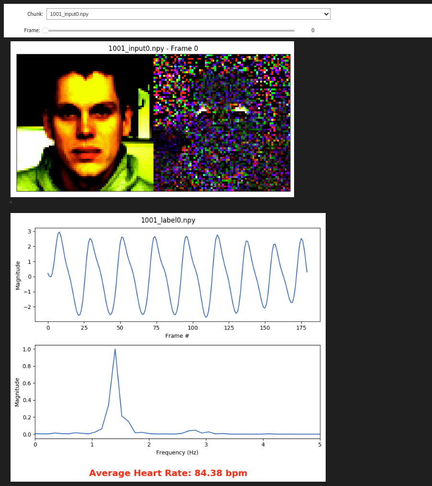

# Preprocessing Visualization Tool

In this folder, we provide an interactive Jupyter notebook to visualize data preprocessed by this toolbox. The notebook, `viz_preprocessed_data.ipynb`, automatically will provide a frame-by-frame visualization of the data, alongside the corresponding plot of the ground truth label and the average heart rate (for that chunk).

Below is an example of what the visualization looks like:
